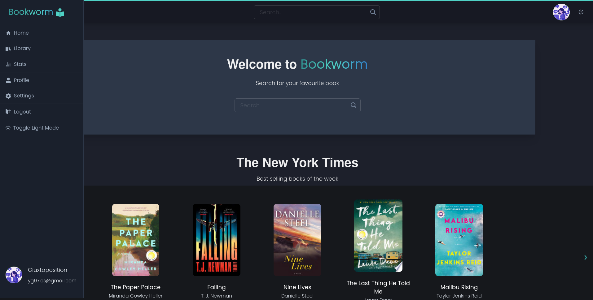

<p align="center">
   
</p>

---

<p align="center">
   
</p>

<p align="center">
<a href='https://bookworm.vercel.app/'>Go check it out 🎉</a>
</p>

---

# :pushpin: Table of Contents

- [:pushpin: Table of Contents](#pushpin-table-of-contents)
  - [:tada: Features](#tada-features)
  - [:construction_worker: Running Locally](#construction_worker-running-locally)
  - [:wrench: Built with](#wrench-built-with)
  - [Backend](#backend)
  - [License](#license)
  - [Contact](#contact)

## :tada: Features

- Search books with Google Books API
- Show Current New York Times Best Sellers
- Add and delete books in your library
- Manage books read state
- Customize your profile page with custom cover, avatar and information
- Show library statistics

## :construction_worker: Running Locally

```
$ git clone https://github.com/giuxtaposition/bookworm.git
$ cd bookworm
$ yarn install
$ yarn start
```

## :wrench: Built with

- React.js
- Chakra UI for styling the ui
- Apollo Client to communicate with the backend
- React Router for routing

## Backend

[Bookworm backend](https://github.com/giuxtaposition/bookworm-backend)

## License

Distributed under the MIT License. See `LICENSE` for more information.

## Contact

Giulia Ye - yg97.cs@gmail.com

Project Link: https://giuxtaposition.github.io/bookworm
